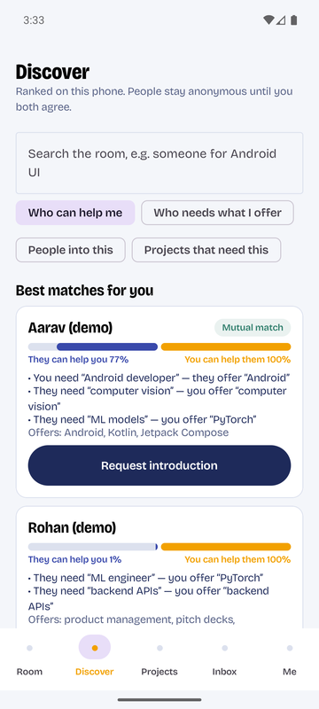
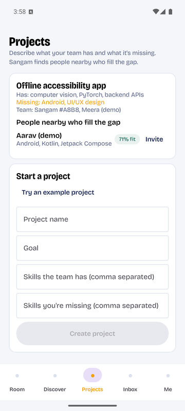
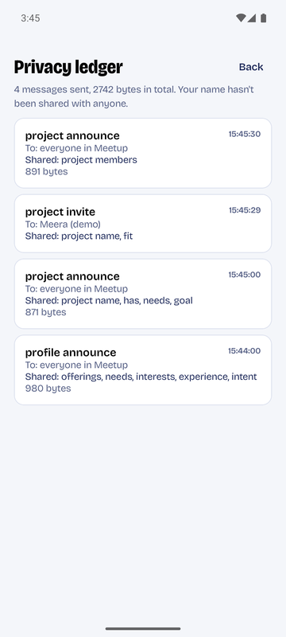
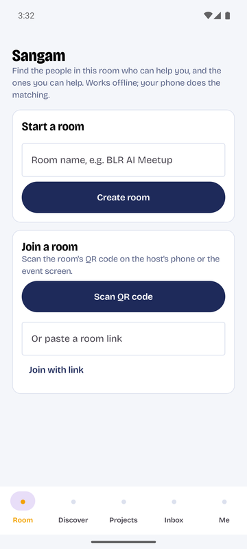
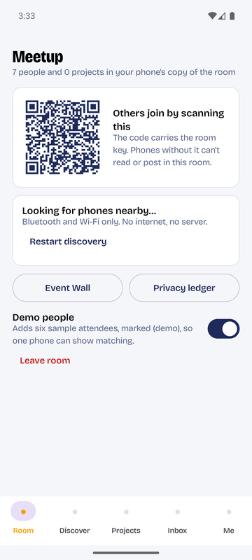
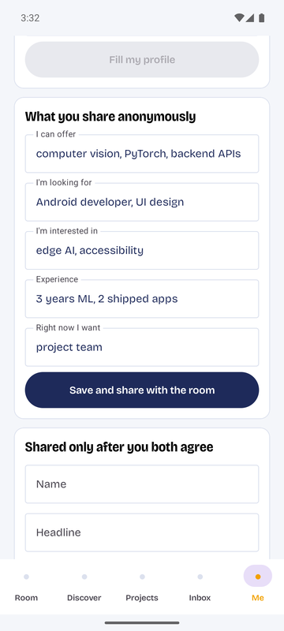
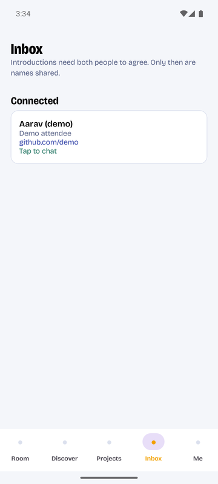
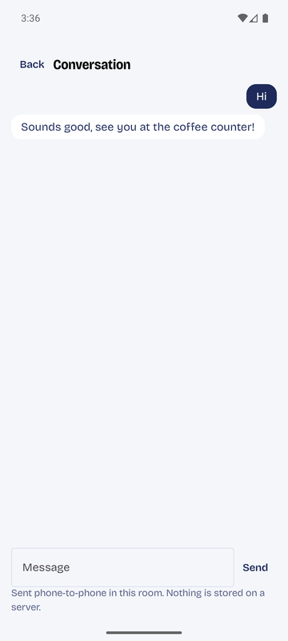
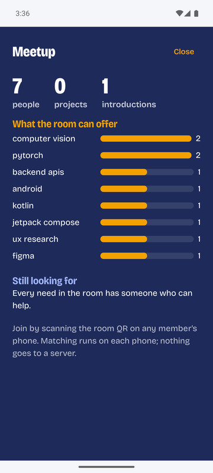

# Sangam

**Find the people in the room who can help you, and the people you can help. Offline, on-device, and anonymous until you both agree.**

*Sangam* (संगम) is Sanskrit for *confluence*, the place where rivers meet. The app turns the phones in a room into a private, serverless community. That room can be a meetup, a conference, a campus fair, a coworking space or a workshop.

- **No internet, no server, no sign-up.** Phones talk directly over Bluetooth and Wi-Fi. The only thing Sangam ever downloads is the optional AI model, once.
- **Matching runs on your phone.** Each phone ranks the people nearby by *mutual* fit: they can help you **and** you can help them.
- **Anonymous by default.** People see what you can offer and what you need, never your name, until you both accept an introduction.
- **Provable privacy.** A built-in ledger shows every message your phone sent, to whom, and which fields it contained.

<p align="center">
  
  
  
</p>

---

## Contents

- [Why this exists](#why-this-exists)
- [Features](#features)
- [Screenshots](#screenshots)
- [How it works](#how-it-works)
- [Security model](#security-model)
- [Architecture](#architecture)
- [Getting started](#getting-started)
- [Using Sangam](#using-sangam)
- [On-device AI](#on-device-ai)
- [Limitations](#limitations)
- [Roadmap](#roadmap)
- [Licence and attributions](#licence-and-attributions)

---

## Why this exists

Put a hundred people in a room and the right connections still mostly don't happen:
- The Android developer who needs a designer sits two tables away from a designer looking for an Android project.
- Neither of them knows.

Event apps try to fix this, but they come with costs:
- **They need internet and an account.** Venue Wi-Fi is unreliable, and sign-up walls lose people.
- **The organiser's cloud owns the attendee graph.** Your profile, your messages and who you talked to sit on someone else's server.
- **Names come first.** You're judged by your name, college or company before anyone sees what you can actually do.
- **Matching is one-sided.** "People interested in AI" isn't the same as "people who need what you have and have what you need".

Sangam takes the opposite approach:
- The room *is* the network.
- Every phone holds its own copy of the room, does its own matching, and decides what it shares.
- Identity is revealed only by mutual consent, and only to that one person.

| | Typical event networking apps | Sangam |
|---|---|---|
| Where matching runs | Organiser's cloud | **On each attendee's phone** |
| Needs internet or sign-up | Yes | **No.** Bluetooth and Wi-Fi only; no account |
| Who holds the attendee graph | The platform | **Nobody.** It lives across the phones in the room |
| Identity | Shown up front | **Anonymous capability cards; names revealed by mutual consent** |
| Proof of privacy | A policy page | **A ledger of every message this phone sent** |

## Features

- **Rooms by QR code.**
  - One person creates a room and shows its QR code; others scan it to join.
  - The code carries the room's secret key, so phones without it can't read or post in the room.
- **Capability profile.** Six fields:
  - what you **offer**;
  - what you're **looking for**;
  - your **interests**;
  - your **experience**;
  - what you want **right now** (a project team, a co-founder, a mentor…);
  - how you like to **collaborate**.
  
  Paste a resume or GitHub README and on-device Gemma fills the profile for you.
- **Discover.**
  - Ranked recommendations with a **confluence bar**: how much they can help you, and how much you can help them.
  - **Reasons** you can check, for example: *You need "Android developer", they offer "Android".*
  - Search with four modes: *Who can help me*, *Who needs what I offer*, *People into this*, *Projects that need this*.
- **Introductions.**
  - Request an introduction to anyone. They see your capabilities and the reasons, not your name.
  - If they accept, names, headlines and contacts are exchanged, sealed end-to-end, with that one person.
- **Chat.** One-to-one messages, end-to-end encrypted and relayed phone to phone.
- **Projects.**
  - Describe what your team has and what it's missing.
  - Sangam ranks the people nearby by how well they fill the gap, so you can invite them directly.
  - Projects stay on your phone across restarts.
- **Event Wall.** An anonymous, live map of the room, made for a projector or a shared screen:
  - the skills on offer;
  - the needs nobody has met yet;
  - how many introductions have happened.
- **Privacy ledger.**
  - Every message your phone sent: when, to whom, which fields, and how many bytes.
  - A one-line summary such as *"Your name hasn't been shared with anyone."*
- **Demo people.** One switch adds six sample attendees, clearly marked "(demo)", so a single phone can show the whole flow.

## Screenshots

| Start or join a room | Room and QR code | Your capability profile |
|:---:|:---:|:---:|
|  |  |  |
| Create a room or join one by scanning its QR code. No account. | The QR code carries the room key. Discovery uses Bluetooth and Wi-Fi only. | What you share anonymously, and what is shared only after you both agree. |

| Discover | Inbox | Chat |
|:---:|:---:|:---:|
|  |  |  |
| Mutual matches with the confluence bar and the reasons. | After both people accept, names and contacts appear. | End-to-end encrypted, phone to phone, nothing on a server. |

| Projects | Event Wall | Privacy ledger |
|:---:|:---:|:---:|
|  |  |  |
| The people nearby who fill your team's gap, with a fit score. | An anonymous live map of what the room offers and still needs. | Every message this phone sent, to whom, and which fields. |

## How it works

```
 Host phone                                     Other phones
 ──────────                                     ────────────
 Create room ──▶ QR code (room id + 32-byte key) ──▶ Scan QR
                         │
                         ▼
     Nearby Connections P2P_CLUSTER mesh over Bluetooth and Wi-Fi
     (automatic discovery, retries with back-off, reconnects)
                         │
                         ▼
     HELLO handshake: each side proves it holds the room key
     before any room data is exchanged
                         │
                         ▼
     Gossip: every message is encrypted with the room key, signed,
     de-duplicated and relayed with a small hop limit (TTL ≤ 3),
     so phones out of direct range still hear each other
                         │
                         ▼
     Each phone keeps its own copy of the room's capability cards
                         │
                         ▼
     On-device embeddings per field → search with reciprocal rank fusion
     → mutual complementarity (my needs ↔ your offers AND your needs ↔ my offers)
                         │
                         ▼
     Introduction request → accept → identity sealed end-to-end
     to that one person → chat → project teams
```

### Matching, in a little more detail

- **Field embeddings.** Each profile field (offerings, needs, interests, experience, intent, collaboration) gets its own vector. That lets Sangam compare *your needs* with *their offerings* directly, instead of comparing whole profiles.
- **Two embedders.**
  - With **EmbeddingGemma** installed, vectors come from the model.
  - Without it, a built-in offline embedder hashes words and character trigrams, and adds **skill concept groups** (so "CV" ≈ "computer vision" and "ML" ≈ "machine learning").
  - It also applies light stemming and ignores role nouns, so "designers" ≈ "designer" and "engineer" alone doesn't create a match.
  - Each embedder has its own calibration, so scores mean the same thing either way.
  - When the embedding model finishes loading, every card is re-embedded so no two vector spaces are mixed.
- **Complementarity.**
  - Two scores are calculated: *they can help you* (your needs against their offerings) and *you can help them* (the reverse).
  - Matches strong in both directions are marked **Mutual match**.
- **Search** fuses rankings from the relevant fields with reciprocal rank fusion (RRF).
- **Project fit** measures how much of a team's *missing* skills a person covers. People already on the team are excluded, and near-zero fits are hidden.
- **Explanations** list the concrete need-to-offer pairs behind each match, so a score is never a black box.

## Security model

| Threat | Protection |
|---|---|
| A stranger nearby listens in | All room traffic is **AES-256-GCM encrypted** with a key from the room's QR code. Phones without the QR code see only ciphertext. |
| A stranger tries to post into the room | Every message carries an **HMAC-SHA256** signature from the room key. Unsigned or wrongly signed messages are dropped and counted. |
| A phone without the key connects over Nearby | A **HELLO handshake** proves possession of the room key before any room data is sent to that phone. |
| A relaying phone reads private messages | Introductions, identity reveals and chat are **sealed end-to-end** per recipient (ECDH P-256 → HKDF → AES-GCM). Relaying phones carry them but can't open them. |
| Forged accepts or project joins | Only the addressed peer can accept an introduction, and only the project owner can add members it invited. |
| Message storms | Hop count clamped to 3, duplicate suppression, payload size limits. |
| Your name leaks | Names and contacts are never part of the public profile. They're sent only after you accept, sealed to that one person, and every send appears in the privacy ledger. |

Each phone has a random guest id and a P-256 key pair, created on first launch and kept only on that device. There's no account, phone number or email anywhere in the protocol.

## Architecture

```
sangam/
├── core/   Pure Kotlin/JVM library: model, matching, protocol, crypto, state (unit-tested)
└── app/    The Android app (Jetpack Compose)
```

### `core/`

| Package | Responsibility |
|---|---|
| `model` | Capability profile and card, identity, field and card kinds |
| `text` | Embedder interface and calibration, the offline hashing embedder with concept groups, the profile-extraction prompt, JSON schema and parser |
| `matching` | `MatchEngine`: per-field search with RRF, complementarity, recommendations, project fit, explanations |
| `protocol` | Message envelope and types, room key (QR encoding, sign/verify, encrypt/decrypt), gossip router, payloads, `PeerCrypto` (end-to-end sealing) |
| `state` | Community state, privacy-ledger entries, Event Wall statistics |

Unit tests cover:
- matching quality and explanations;
- gossip de-duplication and TTL clamping;
- room encryption, signing and tamper rejection;
- end-to-end sealing (only the recipient can open it; ciphertext differs every time);
- key export and import.

### `app/`

| Package | Responsibility |
|---|---|
| `mesh` | `NearbyMesh`: Nearby Connections cluster with discovery, connection retries, back-off and reconnects |
| `community` | The community engine: handshake, sync, room encryption, end-to-end sealing, sender checks, introductions, chat, projects, ledger, demo people |
| `ai` | LiteRT-LM Gemma for profile extraction (GPU or CPU build), EmbeddingGemma for semantic matching, and the verified one-time model downloader |
| `data` | `LocalStore`: guest id, key pair, profile, identity, room, your projects |
| `ui` | Compose screens: Room, Discover, Projects, Inbox, Chat, Me, Event Wall, Privacy ledger |

### Tech stack

- **Language and UI:** Kotlin 2.4, Jetpack Compose (Material 3), kotlinx.serialization, coroutines.
- **Mesh:** Google Play services Nearby Connections (`P2P_CLUSTER`).
- **QR:** Google code scanner (camera), ZXing (QR generation).
- **On-device AI:** [LiteRT-LM](https://github.com/google-ai-edge/LiteRT-LM) running Gemma and EmbeddingGemma.
- **Crypto:** JCA: AES-GCM, HMAC-SHA256, ECDH P-256, HKDF.
- **Build:** Android Gradle Plugin 9, compileSdk 37, minSdk 29 (Android 10+), targetSdk 36.

## Getting started

### Requirements

- Android phones running **Android 10 or newer** with Google Play services. For the full experience, use two or more.
- To build from source: **JDK 17** and the **Android SDK** (platform 37, build-tools 36 or newer).

### Build and install

```bash
git clone https://github.com/nitya-prakash-pandey-2005/sangam.git
cd sangam

./gradlew :core:test            # run the unit tests
./gradlew :app:assembleDebug    # build the app
adb install app/build/outputs/apk/debug/app-debug.apk
```

### On each phone

- Allow the **Nearby devices** permission (plus Location on older Android versions) when asked.
- Keep **Bluetooth** and **Wi-Fi** on. Mobile data and internet aren't needed; airplane mode with Bluetooth and Wi-Fi turned back on works.

## Using Sangam

### With several phones

1. **Phone A, Room:** enter a room name and tap **Create room**. A QR code appears.
2. **Phones B, C…, Room:** tap **Scan QR code** and scan Phone A's code. Each phone shows the people it can see.
3. **Everyone, Me:** fill in what you offer and need, or paste a resume and tap **Fill my profile** (needs Gemma). Then tap **Save and share with the room**.
4. **Discover:** the best matches appear with their confluence bar and reasons. Tap **Request introduction**.
5. **Inbox (the other phone):** tap **Accept**. Both phones now see each other's name and contact. Tap to chat.
6. **Projects:**
   - Create a project with the skills you have and the skills you're missing.
   - Sangam lists the people nearby who fill the gap. Tap **Invite**.
   - The invited person sees the invite in their Inbox and can join.
7. **Room → Event Wall:** the anonymous map of the room. Put it on a shared screen.
8. **Room → Privacy ledger:** check exactly what your phone has sent.

### With one phone

1. Go to **Room** and turn on **Demo people**. Six sample attendees join, each marked "(demo)".
2. On **Me**, tap **Try an example profile**. On **Projects**, tap **Try an example project**.
3. Run the same flow: discover, introduce, chat, invite. Demo people reply and accept automatically, and everything is recorded in the ledger exactly like real traffic.

## On-device AI

Sangam works fully without any model, using the built-in offline embedder. Optional models add:
- **Profile extraction:** Gemma reads a pasted resume, README or bio and fills the six profile fields, using constrained JSON output. The text never leaves the phone.
- **Semantic matching:** EmbeddingGemma vectors replace the hashing embedder for better matching of paraphrases.

### Getting Gemma onto the phone

- **In the app (easiest):**
  - If no model is on the phone, the **Me** tab shows **Download Gemma**, with a progress bar showing size, speed and time left.
  - Sangam picks the right build of [Gemma 4 E2B](https://huggingface.co/litert-community/gemma-4-E2B-it-litert-lm) for the phone:
    - **GPU build** (`gemma-4-E2B-it-gpu.litertlm`, 2.0 GB) on phones with a GPU driver (OpenCL). Faster.
    - **CPU build** (`gemma-4-E2B-it.litertlm`, 2.6 GB) on phones without one.
  - Each download is pinned to one published revision and **checked against its SHA-256** before use. A damaged download is deleted, and you're asked to try again.
  - It uses Android's download service, so it keeps going if you leave the app, resumes after network drops, and shows in your notifications.
  - Wi-Fi is recommended. This is the only time Sangam uses the internet.
- **If a model is already on the phone**, Sangam uses it directly and no download is offered.
  - If its GPU can't run the GPU build, Sangam offers to **switch to the CPU build**.
  - If the file is damaged, it offers to **download it again**.
- **From a laptop**, copy a model into the app's folder (shown at the bottom of the **Me** tab):

  ```bash
  adb push gemma-4-E2B-it-gpu.litertlm /sdcard/Android/data/com.sangam.app/files/models/
  adb push embeddinggemma.litertlm /sdcard/Android/data/com.sangam.app/files/models/   # optional; file name must contain "embed"
  ```

Gemma needs a phone with plenty of free memory (6 GB of RAM or more recommended).

Models aren't bundled with the app. Gemma 4 is released under the Apache 2.0 licence; EmbeddingGemma is covered by the Gemma Terms of Use.

## Limitations

- **Room size.** Nearby Connections clusters suit rooms of tens of phones, not thousands. Gossip relaying extends reach, but very large venues would need several rooms.
- **Public by design.** Capability cards (skills, needs, interests) are visible to everyone holding the room key. Names and contacts are not.
- **Shared room key.** Anyone who can see the QR code can join the room. Private messages are additionally end-to-end encrypted per phone. Public keys are trusted on first sight; there is no key-verification step yet.
- **Ephemeral rooms.** The room exists while phones are in it. Each phone keeps its own projects, profile and identity, but not other people's cards after leaving.
- **Google Play services.** Nearby Connections and the code scanner need Play services.

## Roadmap

- Key verification by comparing a short code in person.
- Optional export of accepted contacts as vCards.
- Multi-room support for large venues, with a shared Event Wall.
- Profile extraction and matching in Indian languages.
- Wi-Fi Aware transport where supported, for larger and faster rooms.

## Licence and attributions

- **Code:** [MIT License](LICENSE) © 2026 Nitya Prakash Pandey.
- **Bricolage Grotesque font:** SIL Open Font License 1.1.
- **ZXing** and **LiteRT-LM:** Apache License 2.0.
- **Google Play services** (Nearby Connections, code scanner): Google APIs Terms of Service.
- **Gemma 4:** Apache License 2.0; **EmbeddingGemma:** Gemma Terms of Use. Neither is bundled; Gemma 4 can be downloaded in the app.
